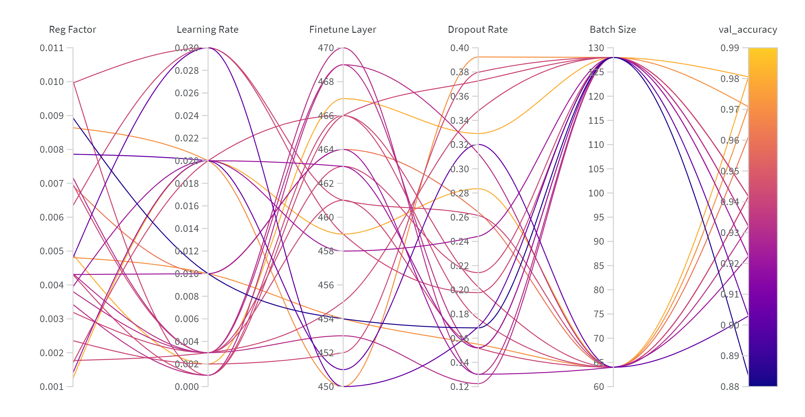
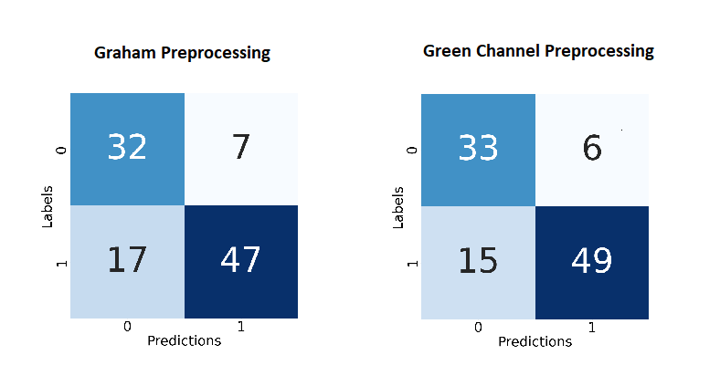
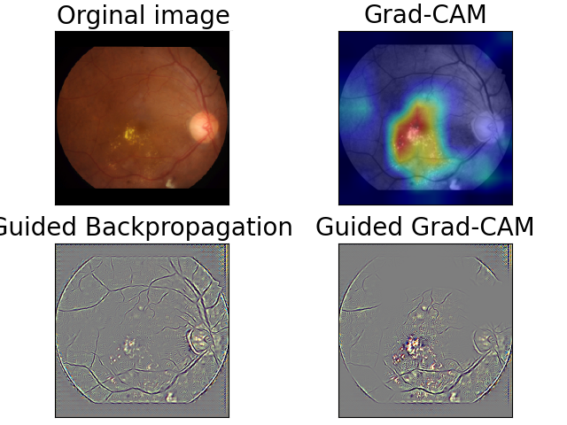

# Diabetic Retinopathy Detection

## How to run the code
Before running the script, make sure the requirements are met by installing from requirements.txt using  
```pip install -r requirements.txt```
1. Configure the config.gin file in /configs

2. Use one of the following commands to perform training/evaluation/visualization. Make sure training is performed before evaluation or visualization. The experiment name which is used for training should be used for evaluation and visualization.

**Note**: Information on using checkpoints for evaluation and visualization can be found in the config file.

#### Train
```python main.py --train True --dir_name "Experiment-name"```

#### Evaluate
```python main.py --eval True --dir_name "Experiment-name"```

#### Visualize (Only for Diabetic Retinopathy)
```python main.py --visualize True --dir_name "Experiment-name"```

3. The files related to the experiment can be found under **/experiments/Experiment-name**

## Directory structure
```
Diabetic-Retinopathy-Detection
|-- configs/
|   |-- config.gin
|-- evaluation/
|   |-- eval.py
|   |-- grad_cam.py
|   |-- guided_backprop.py
|   |-- metrics.py
|   |-- visualization.py
|-- input_pipeline/
|   |-- datasets.py
|   |-- preprocessing.py
|   |-- tf_records.py
|-- models/
|   |-- architectures.py
|   |-- layers.py
|-- utils/
|   |-- utils_misc.py
|   |-- utils_params.py
|-- experiments/
|-- .gitignore
|-- README.md
|-- requirements.txt
|-- datasets
|-- dataset_analysis.ipynb
|-- drbatch.sh
|-- drtune.sh
|-- main.py
|-- train.py
|-- wandb-tune.py
```

## Results
* **Hyperparameter Tuning:**
<p align="center">
	  
</p>

* **Evaluation Accuracy:**
	* Graham Preprocessing: 76.70%
	* Green Channel Preprocessing: 79.61%

* **Confusion Matrix:**
<p align="center">
	  
</p>

* **Deep Visualization:**
<p align="center">
	  
</p>
